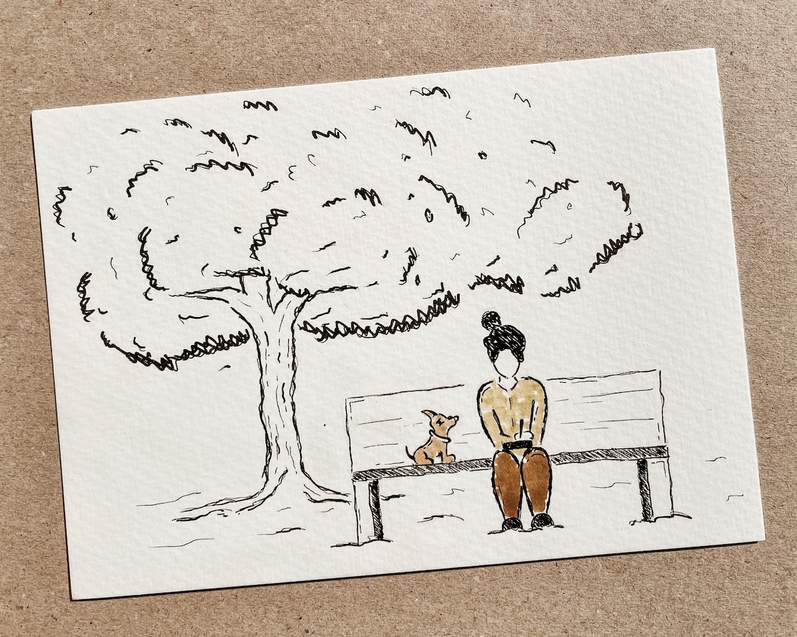

Escrever é um remédio. Não sei se o melhor, mas é certamente uma mezinha caseira que aplico na mente em diferentes fases da vida.

*Ilustração de Carol the Astronaut*

Acho que comecei a escrever no início da adolescência sob influência da minha avó materna, uma poetisa autodidata de uma das terras onde cresci.

Gostava sobretudo de escrever coisas que soassem bonitas, curtas e em verso que mostrava orgulhosamente aos adultos que me educaram quando a vergonha do que punha no papel não tomava conta da minha pele. Sobretudo à tal avó. Sabia-a com sensibilidade para o que lhe levava a ler. Falava sobre o mar, às vezes dos amigos, do vento mensageiro, mas sobretudo das injustiças mundiais do tempo então presente.

Com o passar dos anos a escrita foi-se tornando privada. Pessoal. Diria mesmo: secreta. Transformou-se num refúgio ao qual me dirigia quando as dores de crescimento bateram à porta. Era sobretudo uma ferramenta que me ajudava a pensar, a refletir sobre dores como a perda (de mim e dos outros), identidade, solidão e muitas vezes amores desamores. Ajudou-me a reconstruir por dentro, a colar peças partidas pelo caminho e a equilibrar-me. A palavra ganhou corpo, era matéria viva, expulsa das minhas entranhas através da escrita. Fez-me mais leve quando as vivências me tornaram pesada e menos só quando, novamente mais tarde, resolvi alojar os pensamentos num blogue. Post it out, o seu nome.

Um dia apaixonei-me e para grande surpresa (e sorte) a minha, fui correspondida. Comecei a viver as ilusões e fantasias de um grande amor. A vida ganhou cor, encantos desconhecidos, emoções por explorar e com o passar do tempo, deixei de escrever. Foi como andar de bicicleta sem rodinhas pela primeira vez e usufruir da viagem sem medo de cair. Fui viver.

Decorridos quinze anos, a Covid explodiu. Perdi a avó. Explodiram outras coisas dentro e fora de mim também. Mas foi quando as portas se fecharam para o mundo e toda a gente se via às janelas de casa e do “Zoom” que a escrita reapareceu. Precisava de olhar para dentro novamente. Quando senti esse ímpeto para escrever não o quis fazer igual. Queria que a escrita fosse feliz e não meramente um veículo para expulsar emoções que me tornassem completamente vulnerável à leitura do outro. Exposta. Decidi: vou escrever ficção. Comecei. Não acabei. Foi uma viagem turbulenta. Também. Conheci personagens que gostava de ter na minha vida e não apenas na imaginação. Que chatice. Escrevi pequenos textos, alguns ligados entre si, outros solteiros. Não sei fazer isto. Pensei. Algum tempo depois a escrita voltou a desaparecer quando as portas de casa se voltaram a abrir. Distraí-me com o mundo novamente. E agora voltei. Quero que seja diferente (outra vez). Talvez crónica. Talvez conto. Talvez, de quando em vez, ficção inspirada em vivências. Tudo muito bonito, mas a pergunta que não me sai da cabeça é: se sinto vontade de escrever, o que me dói…?
