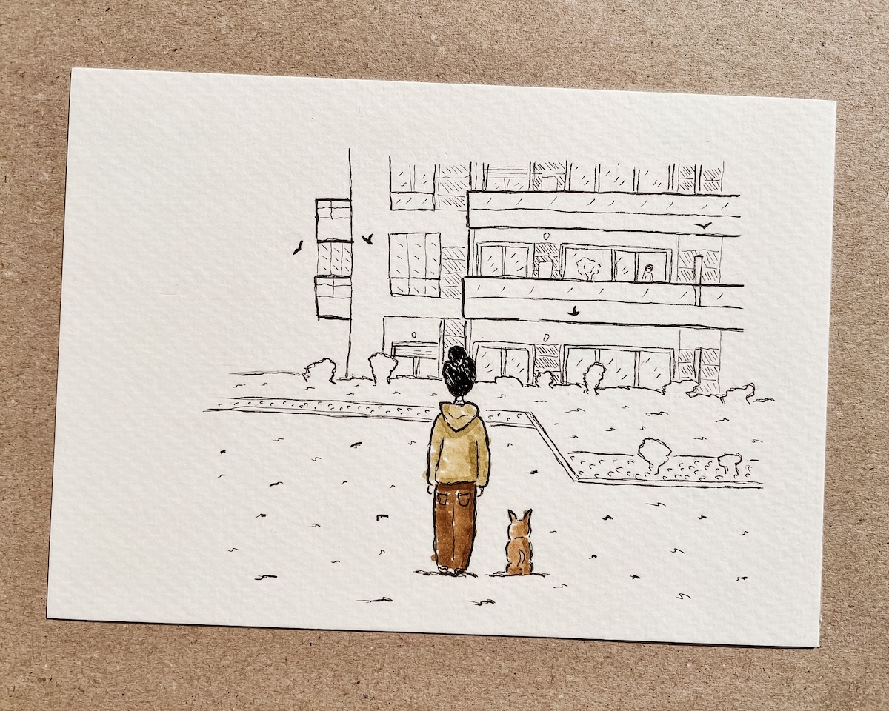

Uma das coisas boas de envelhecer, é que se amontoam histórias cá dentro à espera de serem contadas. Esta é uma delas.

*Ilustração de Carol the Astronaut*

_Lá estão elas_. Disseste, não sei se rabugento por estarem naquele lugar, se curioso pela surpresa da visita. _Onde?_ Perguntei curiosa. _Ali! Não as vês?!_ Reforçaste levantando com dificuldade o braço para apontares o ninho. Foquei-me na ombreira da porta do quarto da frente e com um sorriso fingi que _Sim! Vejo! São duas andorinhas._ Sorriste e pousaste a cabeça na almofada devagar. Neste dia percebi que existem momentos na vida nos quais uma mentira insignificante pode saber a sorte grande.

Não consigo gostar do cheiro a flores mortas. Entristece-me. Talvez por isso aguardasse ansiosa o nascer do dia, sentada naquele sofá de pele, castanho escuro, frio e desconfortável. Acho que foi feito para não adormecermos e conseguirmos espiar a noite de olhos mal abertos. Como um carneiro mal morto. Como uma penitência por estarmos vivos. A luz é trémula, típica de café central de qualquer vila portuguesa nos anos 80, mas ali não se servem bicas nem torradas em pão de forma alto e fofo. Cheira a mofo e flores mortas. Porque há mofo nas paredes pouco brancas e flores a definhar no chão sem terra que as sustente. Pela janela grande e velha vejo que a luz fraca do amanhecer começa a mostrar a silhueta dos plátanos lá fora, e um chilrear distante que rasga o silêncio da madrugada lembra-me que há vida lá fora prestes a acordar. Levanto-me aliviada pelo fim daquele tormento e puxo a porta pesada de madeira deixando-a aberta atrás de mim. De olhos fechados e nariz a apontar para o céu, inspiro o ar fresco primaveril como purga da “moribundice” que me rodeia. Abro os olhos e lá estão elas. Alegres, voando em oitos acrobáticos, ora rente aos telhados, ora rasando as folhas das árvores. Uma dança sem fim que celebra uma estação, a meu ver, da forma mais bela.

Às vezes acho que estar vivo não tem nada de surpreendente. Vejo _spoilers_ em todo o lado que me lembram como acaba. _Ninguém fica cá para sopas._ Dizem. Sinto que toda a beleza que inventamos serve apenas o propósito de nos distrair da nossa frágil realidade. Serve para embandeirar o arco e fingirmos que não morremos todos no fim. Naquela manhã, à porta da igreja de São Pedro, pensei nisto e se não seria a primavera também ela uma tentativa de pintar os dias cinzentos de inverno. E lá estavam elas, a despedirem-se de ti.

Hoje voltei a ouvir o chilrear distante para lá da janela da minha casa. Um despertador da natureza que me lembra que os dias quentes vêm aí. Finalmente. Olho lá para fora e vejo os voos rasantes a entrarem pela minha varanda adentro para saírem logo a seguir em direção ao mar. Vejo-as brincar com as correntes de ar, desafiando a gravidade e a sorte de não embaterem contra o betão do lugar onde vivo. _Exibicionistas._ Penso. Sinto uma pontinha de inveja por não ser dotada de tal mestria, mas feliz por as rever. Vesti o casaco e plantei-me no jardim em frente da minha casa. Eram quatro. Irrequietas, sempre a chilrear umas para as outras fazendo da aventura de encontrar um novo lar a mais divertida das brincadeiras.

_Lá estão elas... Um dia vão fazer ninho na tua varanda._ Sussurras-me na memória. Ao que te respondo em pensamento: _Assim espero avô… assim espero…_
